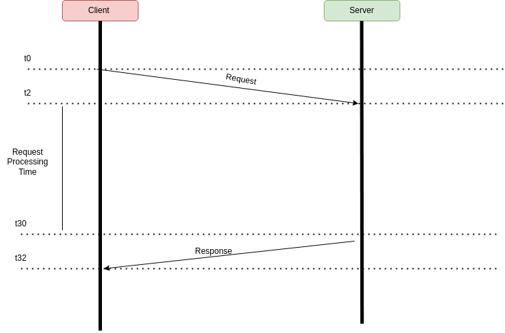
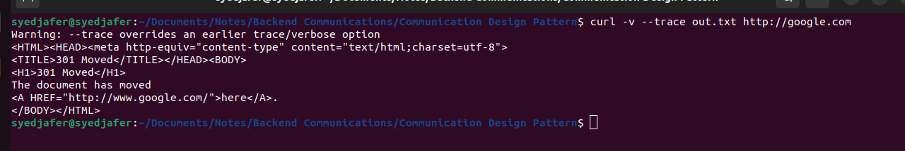

#### Process Flow:

1. Client sends a request
2. Server parses the request
3. server processes the request
4. server sends a response
5. Client parses the response and consume. 

> Parsing XML is way more costlier than parsing JSON; Even parsing JSON is slow, so people are using Protocol Buffers.

#### Where it is used ?

- Web, HTTP, DNS, SSH
- RPC (Remote Procedure Call)
- SQL and Database Protocols. 
- APIs (REST/SOAP/GraphQL) - GraphQL - Packaging different request to one. 

#### Anatomy of a Request/Response

1. A request structure is defined by both client and server. 
2. Request has a boundary.
3. Defined by a protocol and message format.
4. Eg: HTTP Request

> GET /HTTP/1.1
> Headers
> <\CRLF>
> BODY

#### Building an upload image service with request response. 

- Send large request with the image (simple)
- Chunk image and send a request per chunk (resumable)

#### Doesn't work everywhere 

- Notification Service
- Chatting Application
- Very long requests
- What if client disconnects ?

#### Diagram

#### Demo : Curl

> Check the out.txt file in this folder. 

In the response, we always get the headers first and followed by the body.

